<picture>
  <source media="(prefers-color-scheme: dark)" srcset="svg/hero-dark.svg">
  
</picture>

<samp>
  <a href="https://www.linkedin.com/in/advaitdharmadhikari">linkedin</a> ·
  <a href="https://advaitdharmadhikari.netlify.app">portfolio</a> ·
  <a href="https://medium.com/@advaitdharmadhikari7">writing</a> ·
  <a href="mailto:advaitdharmadhikari27@gmail.com">email</a>
</samp>

> I turn ambiguous customer problems into production AI systems — RAG
> architectures, agentic workflows, and multi-agent orchestration shipped under
> real enterprise constraints. I came into AI through business and operations
> rather than pure engineering, which shapes how I work: before models, before
> architecture, before tooling, the question is always
> *what decision are we improving?*

Open to Founding AI Engineer, Applied AI Engineer, Forward Deployed Engineer,
and AI consulting roles in Ireland, Europe, and globally.

## What I'm building now

**Founding AI Engineer & Product Lead — Frensei Innovation Labs (ClawbackVault AI)**
 <samp>Dec 2025 – present · Dublin</samp>

An AI-first compliance intelligence platform for financial-services
broker-dealers. I own full-stack AI architecture, enterprise deployment, and
product strategy from 0 to scale.

- **Cut LLM token spend 80–90% per broker** with a three-stage
  targeted-surveillance pipeline — header scan → PII-masked body fetch → LLM
  signal classification — replacing full-inbox scanning while *strengthening*
  privacy compliance
- **Four-tier signal-detection engine** on Claude Sonnet 4.6 classifying churn
  signals across 15+ behavioural categories, with tiered confidence scoring and
  full evidence-trail audit logging for regulated decisions
- **Cut hallucinated and inconsistent outputs ~60%**, measured on an internal
  eval set of labelled broker threads, by embedding evaluation into the
  production pipeline: eval harnesses, structured-output verification, and
  confidence thresholds calibrated against reviewed outcomes
- **Agentic compliance-research workflows** built around planning, execution,
  verification, and feedback loops, orchestrated with LangGraph and tool /
  function calling
- **CASA Tier 2 and Google OAuth Restricted Scope**, with secure multi-tenant
  deployment across EU-West and Asia-Pacific: AES-256-GCM at rest, PII masking
  ahead of every LLM call, prompt-injection defense, GDPR data-portability
  export, Supabase row-level tenant isolation, Gmail API and Microsoft Graph
  over OAuth 2.0
- **Built and led a 15-person cross-functional team** across AI engineering,
  cybersecurity, and analytics — defining the technical standards, playbooks,
  and delivery practices from scratch, and partnering with the CEO on the
  four-phase roadmap and pricing-tier architecture

## Impact

| Outcome | Context |
|:--|:--|
| **80–90%** LLM token-spend reduction | Targeted-surveillance architecture @ Frensei |
| **~60%** fewer hallucinated / inconsistent outputs | Evaluation embedded in the production pipeline @ Frensei |
| **~20%** operational cost savings | ML optimization across a 300+ aircraft fleet @ IndiGo |
| **~40%** decision-quality improvement | Production ML and BI frameworks on GCP / Azure @ IndiGo |
| **25%** new-business growth | 15-member analyst team @ CHRIST Consulting |

## Activity

<picture>
  <source media="(prefers-color-scheme: dark)" srcset="svg/pulse-dark.svg">
  
</picture>

<picture>
  <source media="(prefers-color-scheme: dark)" srcset="svg/streak-dark.svg">
  
</picture>
<picture>
  <source media="(prefers-color-scheme: dark)" srcset="svg/langs-dark.svg">
  
</picture>

<picture>
  <source media="(prefers-color-scheme: dark)" srcset="svg/year-dark.svg">
  
</picture>

<picture>
  <source media="(prefers-color-scheme: dark)" srcset="svg/now-dark.svg">
  
</picture>

The same numbers as text

<!-- data:start -->

| | |
|:--|--:|
| Contributions (365 days) | 604 |
| Commits / pull requests / reviews | 172 / 4 / 0 |
| Current streak | 4 days |
| Longest streak | 6 days |
| All-time contributions | 732 |
| Active days since 2020 | 134 |
| Public repositories | 37 |

**Languages, by primary language of repository**

| | |
|:--|--:|
| Python | 46% (17) |
| Jupyter Notebook | 38% (14) |
| HTML | 14% (5) |
| JavaScript | 3% (1) |

**Most recently pushed**

| | | |
|:--|:--|--:|
| [AtlasAI](https://github.com/advait27/AtlasAI) | Python | 2026-08-30 |
| [Capstone](https://github.com/advait27/Capstone) | Python | 2026-08-23 |
| [AI-Research](https://github.com/advait27/AI-Research) | Python | 2026-08-20 |
| [advait27.github.io](https://github.com/advait27/advait27.github.io) | HTML | 2026-08-16 |
| [EADIP](https://github.com/advait27/EADIP) | HTML | 2026-07-11 |

Generated 2026-09-05 from `data/snapshot.json`.

<!-- data:end -->

Languages are ranked by the primary language of each repository, not by bytes.
By bytes this profile reads as roughly three-quarters Jupyter Notebook, because
notebooks store rendered cell outputs as base64 inside their own JSON and
Linguist counts those plots as authored code. Ranked by repository, it is
mostly Python, which is the truer answer.

## Research

**Forward Deployed Engineering: A Systems Engineering Perspective** — *preprint, 2026*
 First-author preprint establishing Forward Deployed Engineering as a
systems-engineering discipline, analysed against ISO/IEC/IEEE 15288 lifecycle
processes through a multivocal literature review, proposing a
cross-organizational deployment lifecycle for enterprise AI.

**What Agent Traces Cannot Tell You: Evidentiary Adequacy of Runtime Records for Agentic AI Oversight** — *preprint, 2026*
 First-author paper and open benchmark testing whether agent runtime records
can support the findings of fact that AI oversight requires. Across 1,200
enterprise agent trajectories, six determination families, and four record
conditions, coverage rises from **16.3%** for action logs and OpenTelemetry
GenAI spans to **100%** for a labelled substrate — with weaker records failing
silently.

**Production AI Systems Engineering** — *ongoing open research programme*
 Context engineering, enterprise agent architecture and reliability, AI
evaluation, and AI observability.

## Selected work

**[EADIP](https://github.com/advait27/EADIP) — Enterprise Autonomous Decision Intelligence Platform**
 A governed multi-agent platform that investigates business questions
end-to-end: plan, retrieve, query, verify, report. Shipped across 12 delivery
phases with CI-blocking accuracy, safety, and reliability gates (274 unit and
integration tests). An independent Verification Agent re-derives every numeric
claim before it can enter a report, every side-effecting action is blocked
pending human approval, tenant isolation is enforced with Postgres row-level
security, and a GraphRAG metric-lineage layer grounds "why" questions in the
data.
 <samp>Python · FastAPI · LangGraph-pattern orchestration · Postgres (RLS) · Qdrant · Neo4j · Redis · NL-to-SQL safety gate · OpenTelemetry</samp>

**[Veritas](https://github.com/advait27/Veritas) — self-hosted MCP server**
 Turns Claude into a hypothesis-driven data investigator: builds and
falsifies MECE hypothesis trees over local CSV, Parquet, and Excel data in
DuckDB, enforces deterministic "receipts-or-it-didn't-happen" verification so
every numeric claim traces to an executed artifact, and runs autonomous
opportunity and risk discovery with Benjamini-Hochberg false-discovery-rate
suppression, scored against a public eval suite of planted-cause datasets.
 <samp>Python · MCP · DuckDB · Claude Desktop / Claude Code · Docker · pytest / mypy / ruff</samp>

**ClawbackVault AI** *(Frensei, production)*
 Privacy-first signal intelligence for broker-dealers — targeted-surveillance
architecture, a Claude Sonnet 4.6 signal engine across 15+ behavioural
categories, and an 80–90% reduction in LLM cost per broker.

**Published Python packages** — all six on PyPI

| Package | What it does |
|:--|:--|
| [hallucimap](https://pypi.org/project/hallucimap/) | Hallucination-risk scoring and segment-level triage for LLM outputs |
| [fraudguard](https://pypi.org/project/fraudguard/) | Fraud and anomaly classification pipeline for financial transactions |
| [finfeatures](https://pypi.org/project/finfeatures/) | Financial and time-series feature engineering for quantitative ML |
| [finance-automl](https://pypi.org/project/finance-automl/) | AutoML for financial time series, with leakage prevention |
| [esgprofiler](https://pypi.org/project/esgprofiler/) | Automated ESG scoring and profiling using NLP |
| [mlopter](https://pypi.org/project/mlopter/) | ML-enhanced optimization with pluggable solvers |

Also on GitHub: [ChartSense](https://github.com/advait27/chartsense) (charts →
queryable insight), [Jarvis](https://github.com/advait27/jarvis) (agentic tool
use), [AI Cost & Growth Optimizer](https://github.com/advait27/ai-cost-growth-optimizer),
and [Market Pulse AI](https://github.com/advait27/market-pulse-AI).

## Stack

<samp>
<b>AI engineering</b> 
Forward deployed engineering · agentic AI · multi-agent orchestration · RAG ·
semantic search · vector databases · MCP · tool and function calling · context
and graph engineering
  
<b>LLM &amp; evaluation</b> 
LLM pipeline design · prompt engineering · eval harnesses · hallucination
detection · confidence scoring · structured outputs · inference cost
optimization · LLMOps · Claude · OpenAI · open-weight models
  
<b>Production &amp; platform</b> 
Python · TypeScript · SQL · FastAPI · Docker · PostgreSQL (row-level security) ·
Redis · Qdrant · Neo4j · DuckDB · Supabase · LangGraph · OpenTelemetry ·
CI-gated test suites · pytest / mypy / ruff
  
<b>Cloud &amp; deployment</b> 
GCP · Azure · multi-tenant SaaS · hybrid and VPC deployment · OAuth 2.0 ·
Gmail API · Microsoft Graph
  
<b>Security &amp; compliance</b> 
AES-256-GCM · PII masking · prompt-injection defense · GDPR · CASA Tier 2 ·
Google OAuth Restricted Scope
</samp>

## Experience

**Founding AI Engineer & Product Lead** — Frensei Innovation Labs (ClawbackVault AI)
 <samp>Dec 2025 – present · Dublin, Ireland</samp>

**Business Analyst & ML Engineer** — IndiGo (InterGlobe Aviation)
 <samp>Jan 2024 – Aug 2025 · Gurugram, India</samp>
 ML-driven optimization and decision intelligence across a 300+ aircraft
fleet. Promoted into the ML engineering role within six months of joining;
owned the bridge between data science and executive decision-making.

**Business Intelligence Engineer, Business Technology & Product** — IndiGo
 <samp>Jun 2023 – Dec 2023 · Gurugram, India</samp>

**Business Development Analyst, Team Lead** — CHRIST Consulting
 <samp>Jun 2021 – Jun 2022 · India</samp>
 Led a 15-member analyst team across market-entry and growth-strategy
engagements; ~15% improvement in renewals and upsells.

**Teaching Assistant, Digital Technologies in Business** — University College Dublin
 <samp>Jan – May 2026</samp>
 Postgraduate tutorials on AI in business, digital transformation, and
data-driven decision-making for 150+ students, alongside full-time engineering
at Frensei.

**Business Analytics & ML Mentor** — topmate.io
 <samp>2025 – 2026</samp>
 1:1 coaching on LLM application development and technical positioning for
professionals moving into AI engineering roles.

Earlier: data science and analytics internships at IndiGo, LetsGrowMore, The
Sparks Foundation, and EntryLevel (2020–2023).

## Education

- **MSc, Business Analytics** — UCD Michael Smurfit Graduate Business School *(Sep 2025 – Aug 2026)*
- **PG Professional Certification, AI & Machine Learning** — IIT Kanpur *(2023 – 2024)*
- **BBA, Business Analytics & Data Science** — Christ University, Bangalore *(2020 – 2023)*

Honours: Global Leadership Programme, awarded by the Dean of the UCD College of
Business, and the UCD Advantage Award (UCD Smurfit, 2026).

Certifications: Data Strategy · Google Project Management · Google Business
Intelligence · BCG Advanced Analytics & Data Science · Relational Data on Azure
(Microsoft) · Data Visualization & Analytics.

## Writing and speaking

- **Blog** — [medium.com/@advaitdharmadhikari7](https://medium.com/@advaitdharmadhikari7),
  on applied AI, RAG and agentic architecture, evaluation, and turning AI into
  adopted products
- **Podcasts** — [The Business Technologist](https://open.spotify.com/show/2nMlpUNSqh9ZiI1vsg5B1g)
  · [5 Minute Boosters](https://open.spotify.com/show/32D27hJiy5sEZ7RnULzcBS)

## How this page builds itself

Every graphic above is drawn by this repository. There are no third-party image
services, no stats cards, and no badge CDNs — so there is nothing here that can
rate-limit, go down, or restyle itself without warning.

A nightly [workflow](.github/workflows/refresh.yml) queries the GitHub GraphQL
API into [`data/snapshot.json`](data/snapshot.json), and
[`scripts/render.py`](scripts/render.py) turns that snapshot into the SVGs.
Rendering never touches the network, so the same snapshot always produces the
same bytes and any diff under `svg/` means the data actually moved. The
typeface is JetBrains Mono, subset to just the glyphs each panel draws and
inlined as base64, because an SVG loaded through an `` tag is not allowed
to fetch anything.

Details, including the parts that took the longest to get right, are in
[`docs/how-it-works.md`](docs/how-it-works.md).

---

<a href="mailto:advaitdharmadhikari27@gmail.com">advaitdharmadhikari27@gmail.com</a>
· Dublin, Ireland · English, Hindi, Marathi

